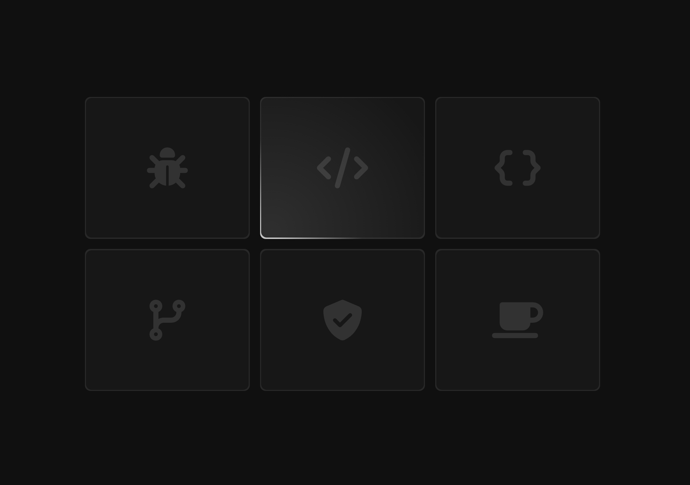

## Hovering torch gradient

> Here applied is a very cool torch like gradient effect when hovering a card.



Featuring:

- Here six cards we pseudo radial gradient a background based on mouse position.

```html
<div id="cards">
  <div class="card"></div>
  <div class="card"></div>
  <div class="card"></div>
  <div class="card"></div>
  <div class="card"></div>
  <div class="card"></div>
</div>
```

- We dynamically produce a `""` pseudo gradient/content `::before` each card.

This pseudo gradient is absolutely positioned "relative" to the parent card. The
before element is relative to it, instead of the default surrounding page.

```css
.card::before,
.card::after {
  content: "";
  position: absolute;
  border-radius: inherit;
  height: 100%;
  width: 100%;
  top: 0px;
  left: 0px;
  /* Remove these two to observe bug where gradient remains on/in card */
  opacity: 0;
  transition: opacity 500ms;
}

.card::before {
  /* JS provides variable for gradient origin: */
  background: radial-gradient(
    800px circle at var(--coords-x) var(--coords-y),
    rgba(255, 255, 255, 0.06),
    transparent 40%
  );
  z-index: 3;
}
.card::after {
  /* JS provides variable for gradient origin: */
  background: radial-gradient(
    600px circle at var(--coords-x) var(--coords-y),
    rgba(255, 255, 255, 0.4),
    transparent 40%
  );
  z-index: 1;
}

/* Apply hover effect here 🧙‍♂️ */
.card:hover::before {
  opacity: 1;
}
```

- Within our script we iterate in a listener to each card of a cards collection.

The star of the show, making use of [getBoundingClientRect](https://developer.mozilla.org/en-US/docs/Web/API/Element/getBoundingClientRect).

This helpful method is used to determine the pointer position in each card. Each
card is going to produce a coordinate value that we `setProperty`. This produces
a CSS variable that is used to update our circle gradient, origin position.

```js
const cards = document.querySelectorAll(".card");

const handleMouseMove = (event) => {
  const { currentTarget: card, clientX, clientY } = event;
  // The `getBoundingClientRect()` method returns a DOMRect object provide
  // info about the element size & its position, relative to the viewport.
  const { left: cardLeft, top: cardTop } = card.getBoundingClientRect(),
    // But we use it to calc our mouse position relative to each card.
    coordX = clientX - cardLeft,
    coordY = clientY - cardTop;
  // ...
  console.table({
    card: { clientX, clientY },
    boundary: { cardLeft, cardTop },
    coordinates: { coordX, coordY }, // coords in each
  });
  //...
  // We use the above to setup custom css properties for each card :)
  card.style.setProperty("--coords-x", `${coordX}px`);
  card.style.setProperty("--coords-y", `${coordY}px`);
  // Back in our radial-gradient we can use this variables!
};

for (let card of cards) {
  card.addEventListener("mousemove", handleMouseMove);
}
```

- Extending the hovering effect on the card and sibling card borders.

Because you can't provide coordinate color to different section of a border. Add
an additional inner child to each card `after` giving (cloudy/opaque) background
that appears as a border but its an inner child that is 100% - 4px in (h/w).

```css
.card-inner {
  position: absolute;
  background: var(--card-inner);
  border-radius: inherit;
  margin: 2px;
  width: calc(100% - 4px);
  height: calc(100% - 4px);
  z-index: 2;
}
```
